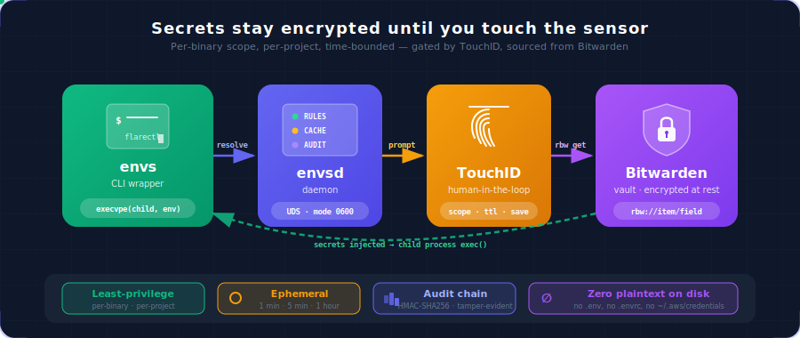

<div align="center">

# envs

**A Lulu-style firewall for environment variables. Bitwarden-backed, TouchID-gated, per-project ephemeral access — built for the AI-agent era.**

<br/>

[](https://crates.io/crates/envs-cli)
[](LICENSE)
[](https://www.rust-lang.org/)
[](#)
[](https://github.com/FGRibreau/envs/actions/workflows/ci.yml)
[](https://github.com/FGRibreau/envs/actions/workflows/release.yml)

<br/>



</div>

---

## What is this?

`envs` is a Rust CLI that wraps any other CLI command (`flarectl`, `wrangler`, `aws`, `gh`, `curl`, your own scripts) and injects secrets from your **Bitwarden vault** into the child process's environment — but only after a **TouchID** confirmation popup, only the env vars you authorize, only inside the project directory you allow, and only for the duration you choose (1 minute, 5 minutes, 1 hour…).

It's `direnv` for the AI-agent era: same convenience, none of the plaintext-on-disk and none of the standing privileges.

---

## Why I built this — the story

I was a long-time happy `direnv` user. `.envrc` files in every project root, `direnv allow`, done. Years of muscle memory, decades of secrets quietly sitting in plaintext on my disk. It worked.

Then **AI coding agents started running on my machine all day long**. They read files. They scan project folders. They execute shell commands. They install dependencies that pull transitive packages I've never inspected. And every single one of those agents, every dependency they pull, runs as my user — which means they can:

- `cat ~/.envrc` and every `.envrc` they walk past
- `printenv` and capture whatever I exported in this shell
- `find ~ -name '*.env*'` to harvest every dotfile-style secret store I forgot I had
- pipe all of it to a remote server through any of the dozens of HTTP clients already on my PATH

I'd watched the [`event-stream`](https://snyk.io/blog/malicious-code-found-in-npm-package-event-stream/), [`ua-parser-js`](https://github.com/advisories/GHSA-pjwm-rvh2-c87w), [`xz-utils`](https://research.swtch.com/xz-script), [`shai-hulud`](https://www.wiz.io/blog/shai-hulud-npm-supply-chain-attack) supply-chain attacks roll past one by one. I'd added the obvious guardrails — strict shell history scrubbing, `.gitignore` lints, secret scanners. None of those help when the secret is already decrypted on disk and the malicious code runs as me.

So I asked myself: **what if my secrets simply weren't on this disk in the first place?**

That's the model `envs` adopts. Secrets live in Bitwarden — encrypted at rest, end-to-end. My laptop holds **pointers** (`rbw://Cloudflare API/CF_API_TOKEN`), never values. When a CLI tool needs `CF_API_TOKEN`, `envs` asks me — face-to-face, via TouchID — for permission to reach into the vault and inject the value, **just for that command, just for that project, just for the next 5 minutes**.

If a malicious agent or supply-chain attacker scans my disk, they find no `.envrc`, no `~/.aws/credentials`, no `.env.production`. Just a couple of TOML files saying "the token for this project lives at `rbw://...`" — useless without the master password and a fingerprint.

### Where the vault lives

I run my own Bitwarden — actually [Vaultwarden](https://github.com/dani-garcia/vaultwarden), the great Rust rewrite of the Bitwarden server — on **[france-nuage.fr](https://france-nuage.fr/)**, a sovereign French cloud host. The setup is documented step-by-step at [getbunker.net/documentation/guides/vaultwarden](https://getbunker.net/documentation/guides/vaultwarden) — if you want EU jurisdiction, no third-party data sharing, and a one-liner deploy, that's the path I took. `envs` works equally well against the official `bitwarden.com` cloud, any other Vaultwarden, or a self-hosted Bitwarden server — anything `rbw` can talk to.

### Beyond just-not-on-disk

Once secrets are centralized, two more wins fall out for free:

1. **Sharing & rotation.** Credentials sit in a shared Bitwarden collection — share with a teammate by adding them to the collection, rotate by editing the value once. The next time anyone runs `envs <cmd>`, the new value is picked up automatically. No more "did everyone update their `.env`?" Slack threads.

2. **Scoped, time-bounded access — the security holy grail.** Each `envs` rule restricts:
   - **Where** — a specific binary path (`/opt/homebrew/bin/flarectl`) inside a specific project root (`~/www/image-charts/`, detected via `.envs/`)
   - **What** — a specific subset of vault entries (you authorize `CF_API_TOKEN` and `CF_ACCOUNT_ID` for `flarectl`, not the whole vault)
   - **How long** — 1 minute, 5 minutes, 30 minutes, or 1 hour. After that, TouchID again.

   This is the concrete implementation of two well-known security principles: **principle of least privilege** (only the env vars that command needs, only inside that project) and **just-in-time / ephemeral credentials** (no standing access — the grant expires automatically). Cloud security folks have preached this for years for production access via tools like HashiCorp Vault and AWS STS; `envs` brings the same model to the developer laptop, where most of us still ran with full standing privileges.

---

## How it works

```
$ cd ~/www/image-charts
$ envs flarectl zone list
       │
       ▼
   ┌───────────────────────────────────────────────┐
   │  envs — authorize secret access?               │
   │                                                │
   │  Command: flarectl zone list                   │
   │  Project: ~/www/image-charts                   │
   │                                                │
   │  Inject env vars:                              │
   │   ☑ CF_API_TOKEN ← rbw://CF_API_TOKEN          │
   │   ☑ CF_ACCOUNT_ID ← rbw://CF_ACCOUNT_ID        │
   │                                                │
   │  Scope:    [Any flarectl in image-charts ▼]    │
   │  Duration: [5 minutes ▼]                       │
   │  Save as:  [Project profile ▼]                 │
   │                                                │
   │            [Cancel] [Authorize via TouchID]    │
   └───────────────────────────────────────────────┘
       │ TouchID OK
       ▼
   flarectl runs with CF_API_TOKEN + CF_ACCOUNT_ID in its environ.
   Decision cached: subsequent calls within 5 min skip the popup.
```

Three Rust binaries cooperate over Unix domain sockets and stdin/stdout pipes: **`envs`** (the CLI wrapper, short-lived), **`envsd`** (the daemon — cache, audit log, rbw client, helper supervisor), and **`envs-prompt`** (the native macOS popup with `objc2-app-kit` + `LAContext`). See [DEVELOPMENT.md](DEVELOPMENT.md) for the architecture.

---

## Why not just use…

| Tool | Why it doesn't fit |
|---|---|
| `direnv` + `.envrc` | Plaintext on disk. The exact problem `envs` solves. |
| `bws run` (Bitwarden Secrets Manager) | Requires `BWS_ACCESS_TOKEN` in plaintext env, no biometric, CI-targeted. |
| `rbw` standalone | No `run` subcommand. `lock_timeout` is global, not per-call/per-binary. |
| `op run` (1Password) | Closest functional match — but for 1Password vaults, not Bitwarden. |
| `aws-vault exec` | AWS-only. Same idea, narrower scope. |
| `envwarden`, `bwsh`, `bws-env` | Non-interactive wrappers. No biometric, no per-call scope. |

`envs` fills the gap for Bitwarden personal vault users on macOS who want consent-gated, scope-limited, ephemeral secret access — for both human-driven shells and AI-agent-driven shells.

---

## Install

### Cargo

```bash
brew install rbw                                # Bitwarden CLI backend
rbw config set email you@example.com
rbw login && rbw unlock

cargo install envs-cli envs-daemon envs-prompt
envs init                                       # one-time setup wizard
```

### Homebrew (once tapped)

```bash
brew install rbw
brew tap FGRibreau/tap
brew install envs
envs init
```

### Prebuilt binaries

Download tarballs from [Releases](https://github.com/FGRibreau/envs/releases). Targets shipped:

`aarch64-apple-darwin` (Apple Silicon), `x86_64-apple-darwin` (Intel Macs).

### From source

```bash
git clone https://github.com/FGRibreau/envs.git
cd envs
cargo build --release --workspace
cargo install --path crates/envs-cli --path crates/envs-daemon --path crates/envs-prompt
```

---

## Quick Start

```bash
# 1. Setup wizard (rbw + LaunchAgent + registry sync)
envs init

# 2. Verify the daemon is up
envs daemon status

# 3. First call: native popup → TouchID → secret injected
envs flarectl zone list

# 4. Inline one-off binding (no profile needed)
envs --bind CF_TOKEN=rbw://CFProd/api_token -- ./deploy.sh

# 5. Compose multiple profiles for a multi-service script
envs --profile cloudflare --profile aws-prod -- ./full-stack-deploy.sh

# 6. See what's currently authorized + when it expires
envs rules list

# 7. Audit who got what, when
envs audit show
envs audit verify              # validate the HMAC chain

# 8. Project-local profiles (.envs/ marker, walked up from CWD)
cd ~/www/image-charts
envs project init              # creates ./.envs/, optionally git-ignored
```

See `envs --help` for the full surface (`run`, `init`, `doctor`, `rules`, `project`, `audit`, `registry`, `daemon`, `completions`).

---

## Security model

`envs` is a **consent gate**, not a sandbox. It guarantees that no secret enters a subprocess without your explicit, biometric-verified authorization. After the grant, the secret is in the child's `environ` and could be read by any other same-UID process — that's a macOS limitation, not an `envs` choice. Read the full threat model in [docs/THREAT-MODEL.md](docs/THREAT-MODEL.md).

What `envs` defends against:
- AI agents / scripts running secrets without your knowledge → **TouchID gate**
- Long-lived plaintext credentials on disk → **values stay encrypted in Bitwarden, only resolved JIT**
- Cross-project secret leakage → **per-project `.envs/` profiles, scope `Any binary` is project-bound**
- Tampered / replaced binaries → **SHA256 + codesign team-id verification, auto-update on legit updates, re-prompt on suspicious change**
- Audit-trail tampering → **HMAC-chained append-only audit log, `envs audit verify` detects edits**

What it does NOT defend against (deliberately):
- Same-UID exfiltration after a granted run (out of scope on macOS without paid Apple entitlements)
- A malicious binary you explicitly authorize (the popup IS the consent — choose what you trust)
- Compromise of your Bitwarden master password / TouchID-protected device

---

## Sponsors

[  
**Natalia**](https://getnatalia.com/)  
24/7 AI voice and whatsapp agent for customer services

[  
**NoBullshitConseil**](https://nobullshitconseil.com/)  
360° tech consulting

[  
**Hook0**](https://www.hook0.com/)  
Open-Source Webhooks-as-a-Service

[  
**France-Nuage**](https://france-nuage.fr/)  
Sovereign cloud hosting in France

> **Interested in sponsoring?** [Get in touch](mailto:rust@fgribreau.com)

---

## Development

See [DEVELOPMENT.md](DEVELOPMENT.md) for build instructions, test commands, code layout, and contribution conventions. The full design + decision log is in [specs/spec.md](specs/spec.md).

---

## Release pipeline

Releases are fully automated via three GitHub Actions workflows:

| Workflow | Trigger | Tool | Purpose |
|----------|---------|------|---------|
| `ci.yml` | push / PR | rust-toolchain, rustfmt, clippy | Run cargo check + test on macOS, fmt + clippy as separate jobs. |
| `release-plz.yml` | push to `main` | [`release-plz`](https://github.com/release-plz/release-plz) | Open a release PR (version bump + CHANGELOG). Merging it tags + creates a GitHub Release + publishes all 4 crates to crates.io. |
| `release.yml` | push of `v*` tag | [`taiki-e/upload-rust-binary-action`](https://github.com/taiki-e/upload-rust-binary-action) | Cross-compile both macOS targets and upload tarballs (containing `envs`, `envsd`, `envs-prompt`, the LaunchAgent template, scripts, README) to the GitHub Release. |
| `homebrew-bump.yml` | release published | [`dawidd6/action-homebrew-bump-formula`](https://github.com/dawidd6/action-homebrew-bump-formula) | Open a PR on [`FGRibreau/homebrew-tap`](https://github.com/FGRibreau/homebrew-tap) bumping the `envs` formula. |

### Required GitHub Environment

Publish secrets live in a GitHub Environment named **`release`** (Settings → Environments → New environment). The `release-plz` and `homebrew-bump` jobs reference it via `environment: release`. The matrix-build `release.yml` only uses `GITHUB_TOKEN` and needs no environment.

Recommended protection rules on the `release` environment:
- **Required reviewers**: yourself — every crates.io publish then waits for an approval click in the Actions UI
- **Deployment branches and tags**: `main` + tag pattern `v*`

### Required secrets (inside the `release` environment)

| Secret | Used by | How to get it |
|--------|---------|---------------|
| `CARGO_REGISTRY_TOKEN` | release-plz | https://crates.io/settings/tokens — scope: `publish-new`, `publish-update` |
| `RELEASE_PLZ_TOKEN` | release-plz | A GitHub PAT (classic) with `repo` scope, **not** the default `GITHUB_TOKEN` (so the tag push it creates triggers `release.yml`). |
| `HOMEBREW_TAP_TOKEN` | homebrew-bump | A GitHub PAT (classic) with `public_repo` scope on `FGRibreau/homebrew-tap`. |

### First-time bootstrap

The Homebrew formula doesn't exist yet in the tap — `dawidd6/action-homebrew-bump-formula` only **bumps** an existing formula. To bootstrap:

1. Cut the first release (push a `v0.1.0` tag, or merge the release-plz PR).
2. Wait for `release.yml` to upload the tarball assets.
3. Generate the initial formula and push it to the tap:
   ```bash
   brew tap FGRibreau/tap
   brew create https://github.com/FGRibreau/envs/releases/download/v0.1.0/envs-v0.1.0-aarch64-apple-darwin.tar.gz \
     --tap FGRibreau/tap --set-name envs
   # edit the generated Formula/envs.rb to install all 3 binaries, then commit + push
   ```
4. Subsequent releases will be bumped automatically by `homebrew-bump.yml`.

---

## License

[MIT](LICENSE) © François-Guillaume Ribreau ( https://fgribreau.com )
